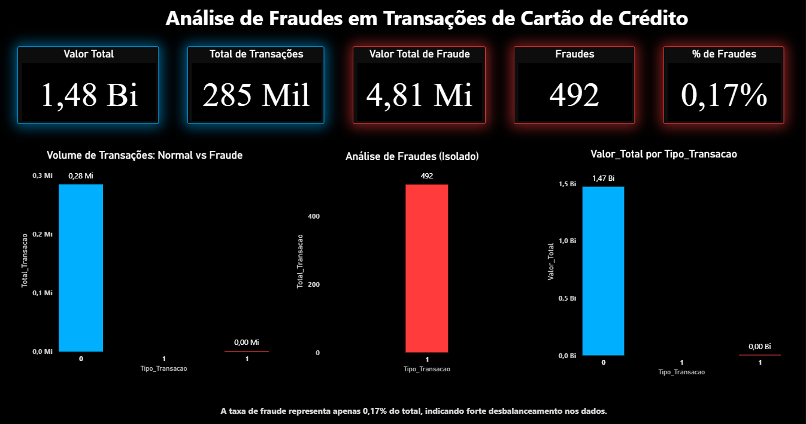

# 📊 # 📊 Análise de Fraudes em Transações de Cartão de Crédito com SQL e Power BI

## 🎯 Objetivo
Analisar padrões de fraude em transações financeiras utilizando SQL e Power BI.

---

## 🛠 Ferramentas utilizadas
- SQL (PostgreSQL)
- Power BI
- DAX

---

## 📊 Principais análises

---

## 📈 Insight principal

As fraudes representam aproximadamente **0,17% do total das transações**, caracterizando um cenário de dados desbalanceados, onde eventos raros exigem abordagens específicas de análise e monitoramento.

Apesar da baixa incidência, esse tipo de ocorrência possui relevância operacional e demanda atenção em contextos de detecção e prevenção.

---

## 📸 Dashboard

## 📂 Queries SQL

As principais consultas utilizadas para análise e validação dos dados estão disponíveis no arquivo `queries.sql`.
